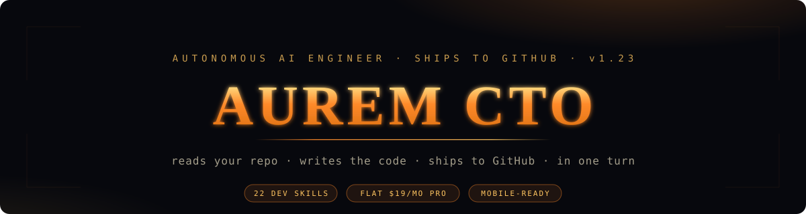

<div align="center">

<br/>



### **ORA reads your repo. Writes the code. Ships to GitHub. In one turn.**

*No PR. No merge conflict. No context switching. Just describe — and it's done.*

<br/>

[](https://auremcto.com/wall)
[](#)
[](#)
[](https://auremcto.com/signup)

<br/>

[**Start free →**](https://auremcto.com/signup) &nbsp;·&nbsp; [**Live product**](https://auremcto.com) &nbsp;·&nbsp; [**Ship Wall**](https://auremcto.com/wall) &nbsp;·&nbsp; [**Wrapped**](https://auremcto.com/wrapped)

</div>

---

<br/>

## What just changed — June 2026

> These aren't roadmap promises. They shipped this week.

| Improvement | Before | After | How |
| :--- | :---: | :---: | :--- |
| **Chat response time** | ~30s | **6–8s** | Layered persona (25k → 5k chars per turn) + retry tuning |
| **Token cost per turn** | 38k tokens | **20k tokens** | Tool help sent on iter 1 only, not every iteration |
| **Tool calling** | Silent failures | **Working** | DeepSeek native `tool_calls` extraction fixed |
| **Thinking UI** | Frozen `thinking…` | **Live 0.1s counter** | Client-side fallback timer, monotonic merge |
| **Stop button** | Left ghost bubbles | **Instant ⏹ Stopped** | Streaming sweep on stop click |
| **Tests** | — | **604 passing** | Regression guards for every iter from 124→135 |

<br/>

---

## Why AUREM exists

GitHub Copilot moved to usage-based token billing on June 1, 2026. Developers with heavy agent usage are reporting monthly bills of **$750+** instead of the previous flat $29.

**AUREM Pro is $19/month, flat.** Ship 5 tasks or 500 tasks — the price doesn't change. No credit pools. No model-tier gates. No surprises.

The four things AUREM does that no other tool combines:

```
  ┌─────────────────────────────────────────────────────────────────────┐
  │                                                                     │
  │  1. DIRECT GITHUB COMMIT  →  Code on main in seconds. No PR.       │
  │  2. PROJECT BRAIN         →  Per-repo memory that never resets.    │
  │  3. F12 BROWSER CAPTURE   →  One <script> tag. Bugs auto-route.    │
  │  4. WORKS ON MOBILE       →  Cursor, Copilot, Claude Code can't.   │
  │                                                                     │
  └─────────────────────────────────────────────────────────────────────┘
```

---

## How it works

```
  You type                ORA thinks              ORA ships
  ────────                ──────────              ─────────

  "Add rate limiting   →  Reads 12 files    →  Writes code
   to /login — 5/min      in parallel           syntax-checks it
   per IP"                Finds the bug         Vanguard scans it
                          Plans the fix         Commits to GitHub
                                                Sends you the SHA
```

Live tape inside the chat shows every step in real time:

```
  14:32:01  ·  0.1s   thinking…
  14:32:03  ·  2.1s   reading 5 files in parallel…
  14:32:05  ·  4.3s   writing backend/routers/auth.py
  14:32:07  ·  6.1s   Vanguard scan passed
  14:32:08  ✓         Done — commit a3f2b1c pushed to main
```

---

## ORA's 23 built-in tools

ORA doesn't guess. It reads first, then acts. 23 real tools — no mocks, no stubs.

```
  READING ──────────────────────────────────────────────────────────────
  semantic_search_repo   find files by concept (USE FIRST)
  read_repo_file         one file by path
  read_repo_files        up to 6 files IN PARALLEL
  list_repo_files        directory tree with glob filter
  search_repo            grep exact pattern across repo

  INTELLIGENCE ─────────────────────────────────────────────────────────
  find_usages            every caller of a function/class
  get_dependencies       package.json + requirements.txt
  get_env_vars           .env.example reader
  detect_framework       auto-detect React/FastAPI/etc
  get_repo_info          project metadata

  GITHUB ───────────────────────────────────────────────────────────────
  get_commit_history     recent commits with SHA + author
  get_commit_diff        exact diff of any past commit
  list_issues            open/closed GitHub issues
  get_pr_comments        PR review feedback

  WEB ──────────────────────────────────────────────────────────────────
  web_search             Google-style search via Tavily
  web_search_and_summarize  search + 1-paragraph answer
  fetch_url              clean text of any public URL
  firecrawl_scrape       JS-rendered scrape fallback
  firecrawl_crawl_site   crawl entire domain
  find_package_docs      npm + PyPI package info

  VALIDATE ─────────────────────────────────────────────────────────────
  validate_syntax        Python AST check (no execution)
  e2b_run_code           real sandboxed Python execution

  LOCAL ────────────────────────────────────────────────────────────────
  execute_bash           read-only pod filesystem access
```

---

## Getting started — 2 minutes to first commit

**1. Sign up with GitHub**

```
auremcto.com → Continue with GitHub → authorize → done
```

No password. No card for free tier.

**2. Connect a repo**

```
Projects → Add Project → paste any GitHub URL

# Both formats work
https://github.com/yourname/your-project
github.com/yourname/your-project
```

**3. Describe your task**

```
✓  "Add rate limiting to /login in backend/routers/auth.py — max 5/min per IP"
✓  "Fix the 422 on POST /api/auth — Accept header is missing"
✓  "Add a dark-mode toggle to components/Navbar.jsx"
✓  "Audit the entire codebase for SQL injection vulnerabilities"
✓  "Why does pillar 4 keep failing — read the worker and tell me"
```

**4. Click Ship. Verify on GitHub.**

```
Click the commit SHA in chat → GitHub diff opens → it's exactly what you asked for
```

---

## ORA's 6 modes

You don't say "use mode C." ORA reads your intent and picks automatically.

| Mode | Name | Trigger | What happens |
| :---: | :--- | :--- | :--- |
| **A** | Chat | Greetings, opinions, "what does X do" | Plain answer, no tools |
| **B** | Advice | Architecture decisions, comparisons | Reasoned recommendation |
| **C ⭐** | **Code Ship** | Fix, build, add, refactor, deploy | Reads → writes → commits (~70% of tasks) |
| **D** | Debug | Bug reports, 422/500 errors, F12 captures | Diagnoses + ships fix |
| **E** | Audit | "audit for secrets", "scan for vulns" | Full codebase security scan |
| **F** | Engage | Market research, landing page copy | Web search + product analysis |

---

## Architecture — how ORA is built

> Full system mapping — every layer that turns a chat prompt into a live commit.

### One-turn flow

```
  ┌────────────────────────────────────────────────────────────────┐
  │                         CHAT TURN                              │
  │                                                                │
  │  User prompt                                                   │
  │       │                                                        │
  │       ▼                                                        │
  │  ┌─────────────────────────────────────────────────────────┐  │
  │  │  LAYERED PERSONA (Iter 130)                             │  │
  │  │                                                         │  │
  │  │  L1 CORE     ██████  5k chars  — always loaded         │  │
  │  │  L2 EXECUTE  ░░░░░░ 13k chars  — action verbs only     │  │
  │  │  L3 REPO     ░░░░░░  2k chars  — repo connected only   │  │
  │  │                                                         │  │
  │  │  Conversational turn:  5k chars (was 20k = -75%)       │  │
  │  │  Full execute + repo: 20k chars (same as before)       │  │
  │  └─────────────────────────────────────────────────────────┘  │
  │       │                                                        │
  │       ▼                                                        │
  │  DeepSeek V3  ──→  tool_calls parsed  ──→  23 local tools     │
  │       │              (fixed Iter 133)                          │
  │       ▼                                                        │
  │  Claude Sonnet  ──→  Watchdog review  ──→  catches errors     │
  │  (Maxx mode only)                                              │
  │       │                                                        │
  │       ▼                                                        │
  │  Vanguard scanner  ──→  25+ security patterns  ──→  commit    │
  │       │                                                        │
  │       ▼                                                        │
  │  ORA shadow-learner ──→  low-confidence detector              │
  │  (Iter 145)              → silent ORA call → learning log     │
  └────────────────────────────────────────────────────────────────┘
```

### Full surface map — 60-second tour

```
╔══════════════════════════════════════════════════════════════════════╗
║                      FRONTEND  (React 19 + Vite)                     ║
╠══════════════════════════════════════════════════════════════════════╣
║  Pages (24)           Landing · Login · Signup · Dashboard           ║
║                       Projects · Deploy · Database · Domain          ║
║                       Tokens · Analytics · Wrapped · ShipWall        ║
║                       Settings · BrainDump · VsDevin · OpsRecipes    ║
║                       Automations · Admin (5 sub-tabs)               ║
║                                                                      ║
║  Hooks (5)            useChatSession · useChatStream · useChatMessages║
║                       useORAPanel · useTextToVoice                   ║
║                                                                      ║
║  Components (30+)     ChatPanel — unified composer-card layout       ║
║                       ORASidePanel — split-screen 35vw panel         ║
║                       MessageBubble · RenderedMessage · CodeBlock    ║
║                       TaskLiveTape · LiveTaskPopup · ShipDialog      ║
║                       Shell — sidebar auto-hide + hot-zone           ║
╚══════════════════════════════════════════════════════════════════════╝
                                  │
                                  ▼  /api/aurem-dev/*  (SSE + REST)
╔══════════════════════════════════════════════════════════════════════╗
║                       BACKEND  (FastAPI 0.115)                       ║
╠══════════════════════════════════════════════════════════════════════╣
║  Routers (26)         chat · cto_projects · github_deploy            ║
║                       hosted_deploy · payments · auth · admin        ║
║                       vault · upload · usage · automations · domain  ║
║                       stacks · support · trust · unlock · wrapped    ║
║                       shipwall · github_oauth · github_bot · harden  ║
║                       lint_preview · engagement · deploy · projects  ║
║                                                                      ║
║  Services (47)        orchestrator · llm · tools_bridge · ora_client ║
║                       ora_learning · ora_council_logger              ║
║                       mode_b_council · mode_d_debugger               ║
║                       mode_e_auditor · mode_f_engage · vanguard_*    ║
║                       project_brain · codebase_indexer · repo_context║
║                       parallel_agents · github_api_writer            ║
║                       mongo_provisioner · sandbox_runner · vault     ║
╚══════════════════════════════════════════════════════════════════════╝
                                  │
                                  ▼
╔══════════════════════════════════════════════════════════════════════╗
║                  PERSISTENCE  (MongoDB Motor async)                  ║
╠══════════════════════════════════════════════════════════════════════╣
║  dev_users  ·  chat_sessions  ·  cto_projects  ·  cto_tasks          ║
║  vanguard_audit  ·  ora_council_logs  ·  ora_learning_logs (new)     ║
║  usage_events  ·  github_deploy_events  ·  feature_flags             ║
║  ship_wall  ·  wrapped_stats  ·  subscriptions  ·  vault_secrets     ║
╚══════════════════════════════════════════════════════════════════════╝
                                  │
                                  ▼
╔══════════════════════════════════════════════════════════════════════╗
║                       EXTERNAL INTEGRATIONS                          ║
╠══════════════════════════════════════════════════════════════════════╣
║  LLM         DeepSeek V3 · Claude Sonnet 4.5 (Maxx) · Emergent LLM   ║
║  Code        GitHub REST API (trees+blobs+commits+refs)              ║
║  Deploy      Vercel webhooks · Emergent hosted MongoDB provisioner   ║
║  Payments    Stripe (flat-fee subscriptions, no token meters)        ║
║  Search      Tavily web search · Firecrawl JS-heavy scrape           ║
║  Observe     Sentry (crash) · F12 browser-error capture (custom)     ║
╚══════════════════════════════════════════════════════════════════════╝
```

### Key sub-systems (June 2026)

| System | Files | What it does |
| :--- | :--- | :--- |
| **6 ORA modes** | `mode_b/d/e/f_*.py`, `mode_classifier.py` | Auto-routes prompts to Chat/Advice/Code-ship/Debug/Audit/Engage |
| **Project Brain** | `project_brain.py`, `codebase_indexer.py` | Per-repo memory: stack, conventions, last 5 commits |
| **Vanguard 007** | `vanguard_audit.py`, `vanguard_scanner.py`, `vanguard_verify_agent.py` | 25+ patterns block AWS/Stripe/GitHub keys, SQLi, XSS, missing auth |
| **Parallel agents** | `parallel_agents.py` | Splits large tasks across backend/frontend/test workers |
| **GitHub direct-commit** | `github_api_writer.py`, `github_auto.py` | Atomic REST commit — no PR, no local `git` binary |
| **ORA shadow-learner** | `ora_learning.py` *(Iter 145)* | Detects low-confidence AUREM replies → background ORA call → learning log |
| **Ask-ORA side panel** | `FloatingORAButton.jsx`, `ORASidePanel.jsx` *(Iter 150-152)* | Split-screen 35vw second-opinion AI, JWT-scoped, TTS + STT |
| **Composer card** | `ChatPanel.jsx`, `composer-card` CSS *(Iter 147)* | Unified input+toolbar surface, status pill bar auto-collapses |
| **Sidebar auto-hide** | `Shell.jsx`, `data-typing-hidden` *(Iter 146)* | Hides on first send; cursor on left-edge hot-zone peeks it back |
| **Repo-help dialog** | `RepoHelpDialog` *(Iter 148)* | Blinking pill + 3-step modal when active project has no GitHub repo |

---

## All features

### 🧠 Project Brain — permanent per-repo memory

ORA remembers everything about every project you connect. Zero re-explaining between sessions.

**Stored automatically**
- Tech stack and exact dependency versions
- Team decisions — *"we decided no Redux, always Zustand"*
- Team preferences — *"always use Tailwind, never inline styles"*
- Last 5 GitHub commit messages and patterns
- Past task outcomes and what worked

**Debug surfaces** (after login)
- `/admin/brain/:projectId` — see exactly what ORA knows about a repo
- Brain Replay — ask ORA to plan without committing
- *Show diff →* — click any past commit SHA, render the diff in chat

---

### 🔒 Vanguard security scanner

Every commit is scanned before it reaches GitHub. Hard block on secrets. Context-aware code patterns injected into the prompt.

| Blocks from committing | Injects into ORA's context |
| :--- | :--- |
| AWS access keys | API security best practices |
| GitHub tokens | Auth implementation patterns |
| Stripe live keys | PCI compliance (payment tasks) |
| Database connection strings | GDPR / privacy-by-design |
| Python `SyntaxError` via AST parse | Frontend XSS patterns |
| JS/TS parse errors via esbuild | Backend hardening checklist |

The security skill injection is automatic — ORA writes more secure code by default on every auth, payment, and API task without you asking.

---

### ⚡ Maxx mode — two-agent review

Enable Maxx in the Ship dialog for critical tasks.

```
  ┌──────────────────────────────────────────────────┐
  │  MAXX MODE                                       │
  │                                                  │
  │  DeepSeek V3  ──generates──▶  Claude Sonnet      │
  │                               │                  │
  │                               reviews for:       │
  │                               - wrong imports    │
  │                               - logic errors     │
  │                               - security gaps    │
  │                               - missing tests    │
  │                               │                  │
  │                               ▼                  │
  │                          commits fix             │
  └──────────────────────────────────────────────────┘
```

Two AI engineers on every task. Available on Pro and Team.

---

### 🔀 Parallel agents — large task splitting

Multi-file tasks spanning the full stack automatically split into 3 simultaneous agents.

| Agent | Owns |
| :--- | :--- |
| ⚙️ Backend | FastAPI routes, services, models, database |
| 🎨 Frontend | React components, hooks, CSS, state |
| 🧪 Tests + Docs | pytest, env vars, README updates |

All 3 commit to the same branch. ORA merges cleanly.

---

### 🌐 Live preview pane

When ORA ships frontend code, Dashboard auto-splits — chat on the left, live preview on the right. Iframe-blob rendering. No deploy, no waiting.

```
  ┌─────────────────────┬──────────────────────────────┐
  │  ORA Chat           │  Live Preview                │
  │                     │                              │
  │  "Add a dark-mode   │  ┌────────────────────────┐ │
  │   toggle to the     │  │  [☀ Dark mode toggle]  │ │
  │   navbar"           │  │                        │ │
  │                     │  │  Your app, live        │ │
  │  ✓ Done — a3f2b1c  │  │  No reload needed      │ │
  └─────────────────────┴──────────────────────────────┘
```

---

### 🤖 Automations — GitHub webhook triggers

Tasks that run without you touching anything.

**Setup — 3 steps**

1. Sidebar → **Automations** → *New automation*
2. Write your task prompt with template variables
3. Paste the webhook URL into GitHub → *Settings → Webhooks*

```bash
# Template variables available in your prompt
{branch}           # branch that was pushed
{pusher}           # GitHub username who pushed
{commit_count}     # number of commits
{commit_messages}  # the commit messages
{repo}             # owner/repo-name
```

Every push to your repo now triggers an ORA task automatically. Good for: auto-docs, auto-tests, auto-changelogs, nightly audits.

---

### 🐛 F12 browser error capture

One `<script>` tag. Every browser error auto-routes to Mode D without you typing anything.

```html
<!-- Add once to your site's <head> -->
<script src="https://auremcto.com/F12ErrorCapture.js"></script>
```

Captures automatically:
- Console errors and warnings
- Network request failures
- Unhandled JavaScript exceptions
- Full stack traces with file + line

ORA receives the error payload and classifies it as Mode D. It reads the relevant source files and ships a fix. You just click Ship.

---

### 📊 ORA Wrapped — monthly stats

A Spotify-style card of your coding activity. Visit **/wrapped**.

| Tasks shipped | Time saved | Repos touched | Day streak |
| :---: | :---: | :---: | :---: |
| 23 | ~17h | 4 | 7 |

One click to share on X or LinkedIn. Good for showing your velocity to investors or your team.

---

### 🏆 Ship Wall — public commit feed

Every task ORA ships appears at **auremcto.com/wall** — your name, repo, task summary, commit SHA, time. Public proof of what you're building.

```markdown
<!-- Drop this badge in your repo README -->
[](https://auremcto.com/wall)
```

---

### 🔐 Security architecture

| Data protection | Code safety |
| :--- | :--- |
| GitHub PAT encrypted at rest (HKDF-Fernet) | Python AST parse before every commit |
| JWT tokens, 7-day expiry, httpOnly | JS/TS esbuild parse validation |
| Security headers on every response | Vanguard 007 — 25+ secret patterns |
| CORS restricted to auremcto.com | Unsourced citation detection |
| Rate limit: 30/min chat, 10/min tasks | Full rollback endpoint at any time |
| Per-customer data isolation, mandatory ID scoping | Anti-hallucination contract enforced |

---

## Honest comparison

> June 2026. No marketing claims — only verifiable features.

| Feature | **AUREM CTO** | Cursor 3 | Copilot | Claude Code | Devin |
| :--- | :---: | :---: | :---: | :---: | :---: |
| Direct GitHub commit (no PR) | ✅ **only AUREM** | ❌ | ❌ | ❌ | ❌ |
| Per-repo permanent memory | ✅ Project Brain | ❌ | ❌ | ❌ | ⚠ limited |
| F12 browser error capture | ✅ | ❌ | ❌ | ❌ | ✅ Chromium |
| Web UI — no IDE needed | ✅ **+ mobile** | ❌ | ❌ | ❌ terminal | ❌ |
| Flat-fee pricing | ✅ $19/mo | ❌ credit pool | ❌ token billing | ✅ plan limits | ❌ per-task |
| Security scanner pre-commit | ✅ 25+ patterns | ❌ | ❌ | ❌ | ❌ |
| Two-agent code review | ✅ Maxx | ❌ | ❌ | ❌ | ❌ |
| Live preview pane | ✅ iframe blob | ❌ | ❌ | ❌ | ❌ |
| Parallel agents | ✅ 3 domains | ✅ 8 agents | ❌ | ❌ | ❌ |
| Webhook automations | ✅ | ✅ | ❌ | ❌ | ❌ |
| Commit history learning | ✅ `get_commit_diff` | ❌ | ❌ | ❌ | ✅ |
| Response time | **6–8s** | ~8s | ~5s | ~10s | ~30s |
| Entry paid price | **$9/mo** | $20/mo | $10/mo* | $17/mo | $20/mo |

*GitHub Copilot switched to usage-based token billing June 1, 2026. Heavy users reporting $750+/mo vs the previous $29 flat.*

**The combination that doesn't exist anywhere else:**
direct GitHub commit **+** Project Brain memory **+** F12 capture **+** mobile web UI **+** flat pricing.

---

## Pricing

```
  ┌──────────┬──────────┬──────────────┬──────────────┐
  │  FREE    │ STARTER  │    PRO ⭐    │    TEAM      │
  │   $0     │  $9/mo   │   $19/mo     │   $49/mo     │
  ├──────────┼──────────┼──────────────┼──────────────┤
  │ 10 tasks │ 50 tasks │  Unlimited   │  Unlimited   │
  │          │          │              │  per user    │
  ├──────────┼──────────┼──────────────┼──────────────┤
  │ Ship     │ Ship     │  Ship        │  Ship        │
  │ Chat     │ Chat     │  Chat        │  Chat        │
  │          │ Brain    │  Brain       │  Brain       │
  │          │          │  Maxx 100/mo │  Maxx ∞      │
  │          │          │  Parallel    │  Parallel    │
  │          │          │  Preview     │  Preview     │
  │          │          │  Automations │  Automations │
  │          │          │              │  Admin panel │
  │          │          │              │  Priority Q  │
  └──────────┴──────────┴──────────────┴──────────────┘
```

### Cost transparency

```
AUREM's cost per task              Why $19 Pro works
──────────────────────────         ──────────────────────────────
DeepSeek V3   ~$0.02–0.04         Avg developer ships 20–50 tasks/mo
Claude Sonnet ~$0.01–0.02         Break-even at 300–600 tasks/mo
Total         ~$0.03–0.06         At 200 tasks → still profitable
                                  At 500 tasks → you saved ~$30k/yr
                                  vs Devin per-task pricing
```

---

## Tips for best results

**Be specific about files.** *"Fix login"* takes 3 iterations. *"Fix the 422 on `/api/auth/login` in `backend/routers/auth.py` line 78"* takes 1.

**Use F12 capture for bugs.** Drop the `<script>` in your `<head>` once. Every browser error routes to ORA automatically from then on.

**Enable Maxx for critical code.** Auth flows, payment handlers, database migrations — let Claude review DeepSeek's work before it commits.

**Build Brain context early.** Tell ORA your decisions once. *"We use Zustand not Redux. Always Tailwind. No inline styles."* It remembers forever.

**Parallel reads are free.** ORA reads 5 files in one turn at the same cost as 1 file. Ask broad questions — ORA will go read everything relevant before answering.

---

## Useful links

| Product | Admin (after login) | Contact |
| :--- | :--- | :--- |
| [auremcto.com](https://auremcto.com) | `/admin/overview` — system health | ora@aurem.live |
| [/wall](https://auremcto.com/wall) — ship feed | `/admin/architecture` — code map | Settings → Support |
| [/wrapped](https://auremcto.com/wrapped) — your stats | `/admin/brain/:projectId` — brain debug | GitHub Issues for bugs |
| [/signup](https://auremcto.com/signup) | `/automations` — webhook config | |

---

<div align="center">

<br/>

**Built for developers who'd rather ship than explain themselves to a chatbot.**

*ORA reads your repo. Writes the code. Ships to GitHub.*
*You just describe the task.*

<br/>

[**Start free — no card required →**](https://auremcto.com/signup)

<br/>

</div>
